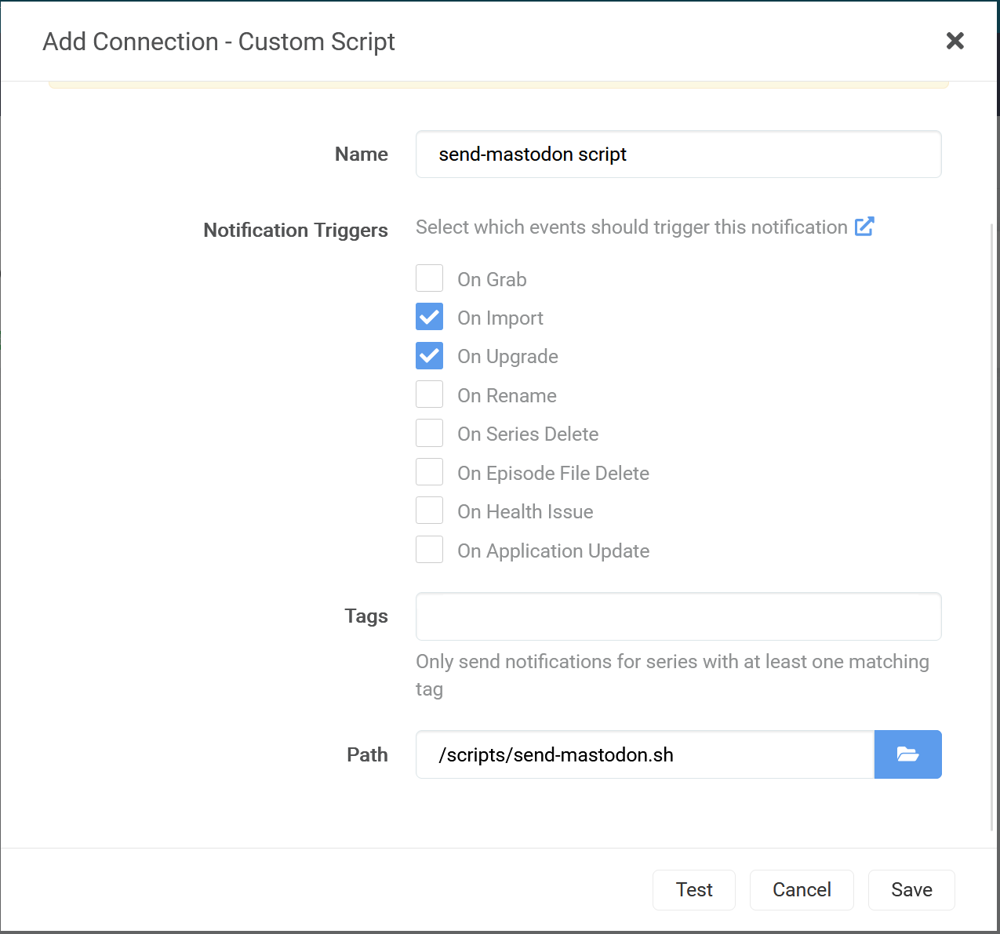

# send-mastodon
A simple script to parse some environment variables (from *arr apps), and send a message to mastodon.

## Requirements
I wanted something that worked with the various apps I use:
- [sonarr](https://sonarr.tv/)
- [radarr](https://radarr.video/)
- [lidarr](https://lidarr.audio/)
- [readarr](https://readarr.com)

I also use the docker images for all these from [linuxserver.io](https://www.linuxserver.io/), so I wanted something that I could put in one place and have them all use, WITHOUT having to add extra packages to the docker images. Finally, I run them on an ARM machine, so I wanted to avoid having to compile for different architectures/etc.

## The script
The script uses the following tools, all already in the docker images for all of the above apps. Bold ones are the main things:
- **bash**
- **curl**
- cut
- date
- md5sum
- sed

The script uses AI* to determine what app is talking to it, based off the environment variables, then formats messages appropirately for each.

\* some if-else statements

## Installation/Use
Put the script somewhere the applications can access it. For my purposes (docker), I put the script in a directory and then mapped that directory to each instance as read-only.

Edit the script and set TOKEN and DOMAIN. TOKEN is the Access Token for the Application you've created in your Mastodon account.  See [this blog post](https://blog.joyrex.net/making-a-mastodon-bot-account-and-integrating-with-arrs) for information about getting a mastodon account set up.

Go to each of the apps->Settings->Connect->"+" sign button->Custom Script

Add in the script and select Test.

## Customisation
If you look at the script, you'll see it basically only worries about a couple event types, not all the event types each application offers. This is because I only use a couple notifications, so didn't bother filling it out. Using the existing script, you should be able to tailor it how you'd like.

The list of environment variables it can use (and the event types) are listed here for each application:
- [sonarr](https://wiki.servarr.com/sonarr/custom-scripts)
- [radarr](https://wiki.servarr.com/radarr/custom-scripts)
- [lidarr](https://wiki.servarr.com/lidarr/custom-scripts)
- [readarr](https://wiki.servarr.com/readarr/custom-scripts)